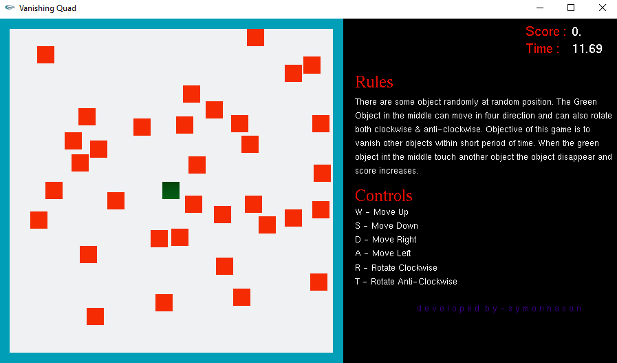

# Vanishing-Quad
OpenGL Mini Game

## About
There are some object randomly at random position. The Green object in the middle can move in four direction and can also rotate both clockwise & anti-clockwise. Objective of this game is to vanish other objects with the green quad within short period of time. When the green object in the middle touch another object the object disappear and score increase.

## Screenshot

## Controls

  W - Move Up
  S - Move Down
  D - Move Right
  A - Move Left
  R - Rotate Clockwise
  T - Rotate Anti-Clockwise

## To Run The Game

1. Copy glut32.dll and paste it to C:\Windows\System32 directory

2. Now run the VanishingQuad.exe and play.

## To See The Source Code

Simply open main.cpp file in Notepad.

## To Execute The Code In Code::Blocks

1. Copy glut32.dll and paste it in C:\Windows\System32 directory

2. Copy glut.h and paste it in C:\Program Files (x86)\CodeBlocks\MinGW\include\GL directory

3. Copy glut.lib and paste it in C:\Program Files (x86)\CodeBlocks\MinGW\lib directory

4. Now Open Code::Blocks IDE

5. Create a new Glut Project by File > New > Project > GLUT Project

6. Paste the main.cpp to the project folder

7. Run The Program

Thank You

                                     all right reserved to © s y m o n h a s a n
